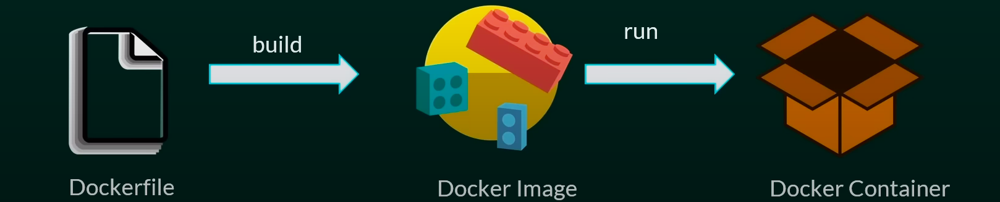

# Docker for Beginner

## What is Docker?

    - Docker is an open platform for developing, shipping, and running application.
    - Docker is a platform which packages an application and all its dependencies together in the form of containers.

## Docker Image:

    Helps in managing container.

# Dockerfile, Image & Container

## Dockerfile

    Text Document which contains all the commands that a user can call on the command line to assemble an image.

## Docker Image

    Template to create Docker container.

## Docker Container

    - Running instance of the docker image.
    - Docker Containers hold entire package to run application.



# Installation Of Docker (Method 1)

## Installation of Docker in ubuntu system

Important: Make sure to remove any older Docker installations before installing a new one. Removing previous Docker versions doesn't delete the images, containers, volumes, or networks you have created. Run the following command to uninstall previous versions:

```
sudo apt-get remove docker docker-engine docker.io containerd runc
```

Step 1: Update the Package Repository

```
sudo apt update
```

Step 2: Install Prerequisite Packages

```
sudo apt install apt-transport-https ca-certificates curl software-properties-common -y
```

Step 3: Add GPG Key

```
curl -fsSL https://download.docker.com/linux/ubuntu/gpg | sudo apt-key add -
```

The output should state OK, verifying the authenticity.

Step 4: Add Docker Repository

```
sudo add-apt-repository "deb [arch=amd64] https://download.docker.com/linux/ubuntu $(lsb_release -cs) stable"
```

Step 5: Specify Installation Source
Execute the apt-cache command to ensure the Docker installation source is the Docker repository, not the Ubuntu repository. The apt-cache command queries the package cache of the apt package manager for the Docker packages we have previously added.

```
sudo apt-cache policy docker-ce
```

Step 6: Install Docker

```
sudo apt install docker-ce -y
```

Step 7: Check Docker Status

```
sudo systemctl status docker
```

# Installation of Docker (Method 2)

## Installing Docker from the Default Repositories (Option 2)

Another way to install Docker on Ubuntu is to use the default Ubuntu repository. Although the installation process is more straightforward, the Docker package may be outdated. If you don't care about having the latest Docker version, follow the steps below and install Docker using the default repository.

Step 1: Update the Repository

```
sudo apt update
```

Step 2: Install Docker

```
sudo apt install docker.io -y
```

Step 3: Install Dependencies

```
sudo snap install docker
```

Step 4: Check Installation

```
sudo systemctl status docker
docker --version
```

## Some important commands of docker are

Docker hub is the official repository for the images of Docker
https://hub.docker.com/

Check Version of Docker

```
docker --version
docker -v
```

Pull image from docker hub

```
docker pull image-name

docker pull hello-world
```

Pull image with specific tag

```
docker pull image-name:tag

docker pull openjdk:18
```

show all the images in your system

```
docker images
```

Search any images of docker in terminal

```
docker search image-name

docker search MySql

```

Run you images

```
docker run image-name
docker run python
```

Run your images in detached mode and by giving the specialName

```
docker run --name CustomName -d imageId

docker run --name pythonContainer -d 0a6cd0db41a4
```

here,

- **--name** is used for giving custom name to the container
- **-d** is used for running container detached mode
- **0a6cd0db41a4** is the image id.

show the running process

```
docker ps  (desc - show only  still in running phase )

docker ps -a (desc- show all the running processes)

```

The above commands for running images will make the container for few seconds and container automatically got shutdown, to solve this problem we have to add **_-it_** flag while running the image like
docker

```
docker run --name customName1 -it -d imageName

docker run --name pythonContainer1 -it -d python

docker ps
```

How to use your running container and execute commands on it

```
docker exec -it runningContainerId CommandWantToExecute

docker exec -it 5cae52935840 python3
```

to see all the information of any docker image

```
docker inspect imageId

docker inspect 0a6cd0db41a4

```
